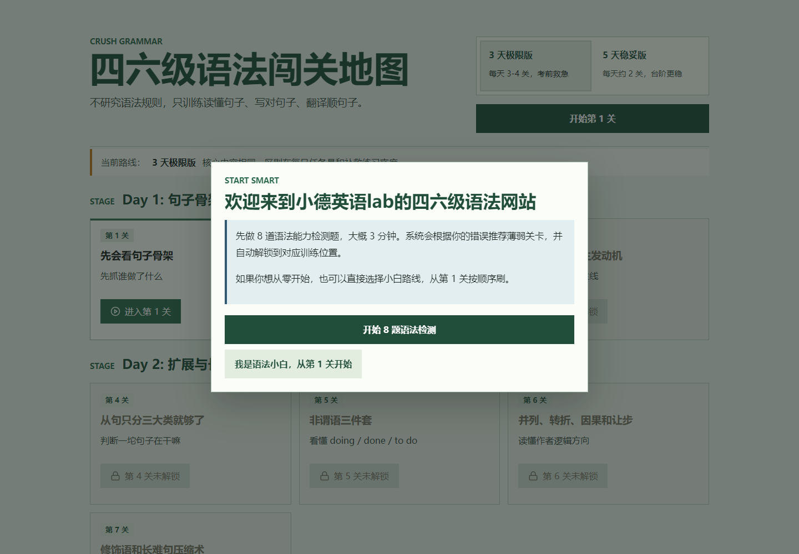
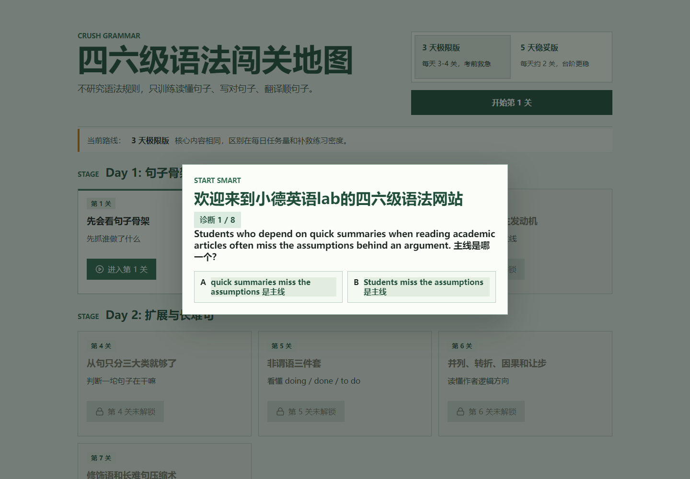
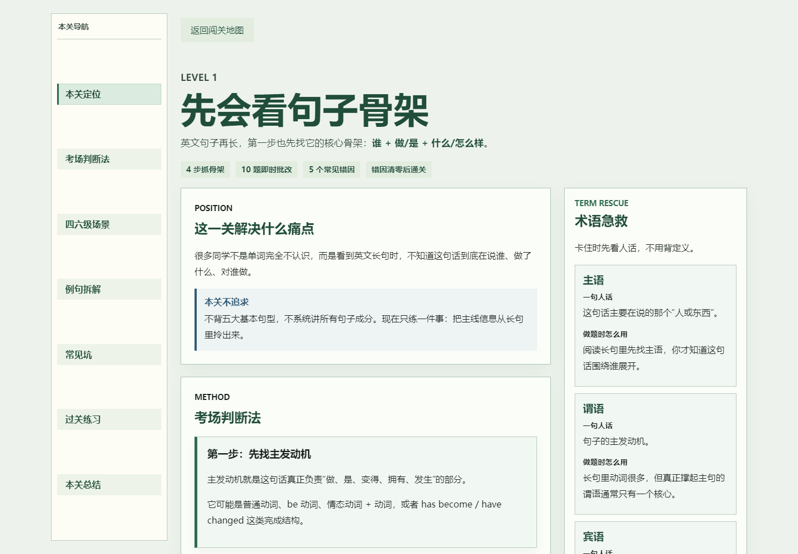
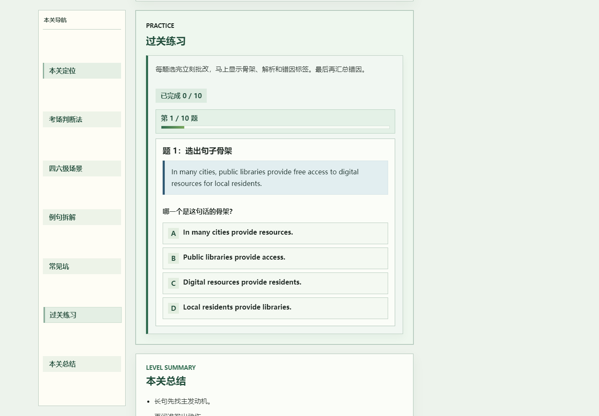
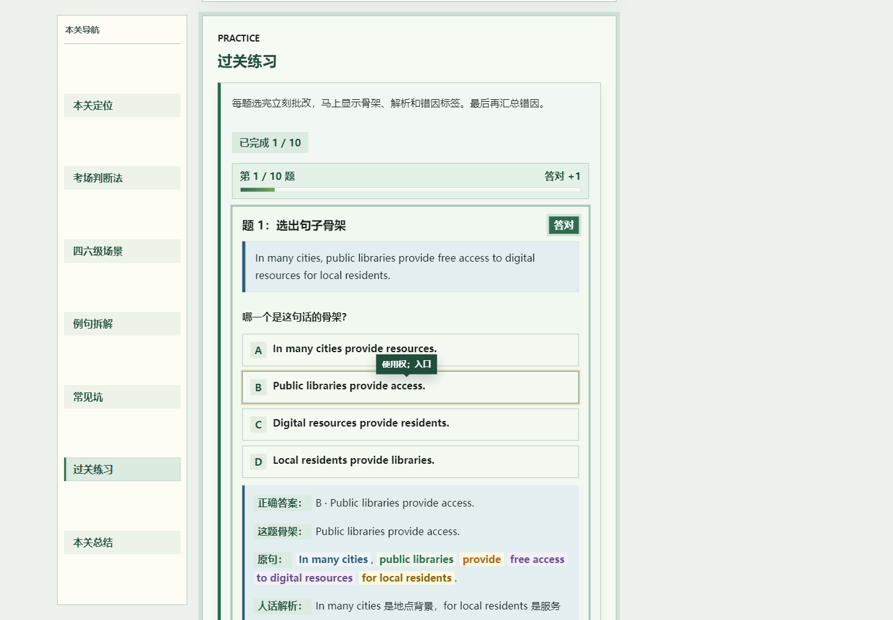

# 小德英语 lab 四六级语法网站使用介绍与 6 分钟口播稿

网站地址：https://crushgrammar.pages.dev/

这份文档用于自媒体发布前的口播准备：先说明网站怎么用，再提炼亮点和注意事项，最后给出一版约 6 分钟的口播文案。配图来自当前线上版本，截图放在 `docs/assets/creator-guide/`。

## 一、网站怎么用

1. 打开网站后，会先看到欢迎弹窗。
2. 如果你不确定自己语法薄弱点在哪里，建议点击「开始 8 题语法检测」。
3. 如果你觉得自己基础比较弱，或者想完整补一遍，可以点击「我是语法小白，从第 1 关开始」。
4. 诊断完成后，系统会根据答题情况推荐对应关卡；从零开始则会按关卡地图顺序推进。

关卡地图分成不同训练阶段。每关不是背一堆抽象语法名词，而是围绕一个真实痛点训练：先读懂句子骨架，再处理修饰、从句、并列转折、因果让步等四六级里最容易卡住的句子结构。

诊断题大约 8 道，难度会比普通入门题更接近四六级阅读和翻译中真实会遇到的句子。做完后，网站会给你更适合的起点。

进入具体关卡后，左侧会常驻本关目录，可以快速跳到「本关定位」「考场判断法」「例句拆解」「常见坑」「过关练习」「本关总结」等位置。右侧还会有「术语急救」，遇到主语、谓语、宾语这些概念卡住时，可以马上看一句话解释。

学完本关后，进入「过关练习」。题目会按一题一页的形式推进，答题后立刻显示答案、句子骨架、词块标注、错因标签和人话解析。

如果答对，系统会给出明确的正向反馈，并继续推进下一题；如果答错，会告诉你卡在哪一种错因上，并在后面汇总可补救的训练方向。

## 二、网站亮点

第一，入口不是强迫所有人从第 1 关开始，而是先用 8 道诊断题定位薄弱点。基础弱的同学可以从 0 开始，基础还可以的同学可以直接补自己最容易失分的地方。

第二，它不按传统语法书的方式讲知识点，而是按四六级真实读句子的顺序训练：先看句子骨架，再看修饰成分，再看逻辑关系，最后落到阅读、写作和翻译里的真实使用。

第三，每一关都有清晰目录和过关练习。学生不是看完就算了，而是必须通过题目验证自己是否真的会用。

第四，做题反馈比较具体。它不会只告诉你对错，而是把原句拆成词块，告诉你哪部分是主干、哪部分是修饰、哪部分是时间地点原因方式，还会标出中高难词的中文意思。

第五，错因会被汇总，后面可以直接点补救方向。这样学生不会只知道自己错了，而是知道下一步该补哪里。

## 三、使用时要注意什么

1. 建议优先用电脑端打开。网站手机端可以访问，但目前课程目录、长句拆解和刷题反馈在电脑大屏上阅读效率更高。
2. 学习时不要急着刷题。每关前面的「本关定位」「考场判断法」是为了帮你建立判断框架，建议先看完再练。
3. 过关练习不要只看选项对错，要重点看下面的「句子骨架」和「人话解析」。真正提分的地方在这里。
4. 网站会在当前浏览器保存学习进度。如果换设备、换浏览器，或者清除浏览器数据，进度可能需要重新开始。
5. 诊断题只是帮你找到起点，不是考试分数。做错很正常，重点是用它发现薄弱点。

## 四、约 6 分钟口播文案

### 0:00-0:35 开场

画面建议：展示网站首页和欢迎弹窗。

大家好，我是小德。最近我做了一个专门给四六级同学用的语法训练网站，名字叫「小德英语 lab 四六级语法网站」。它不是那种一上来就让你背语法术语的网站，也不是把高中语法书重新搬一遍。

它解决的是一个很具体的问题：很多同学单词背了，题也刷了，但一遇到长句就不知道主线在哪里；翻译和写作的时候，中文想明白了，英文句子却搭不起来。这个网站就是为了解决这种「看不懂长句、写不出顺句」的问题。

### 0:35-1:25 入口选择

画面建议：展示 8 题诊断弹窗。

第一次打开网站时，会先弹出一个欢迎窗口。这里有两个选择。

如果你不确定自己语法到底弱在哪里，可以先做 8 道语法能力检测题，大概 3 分钟。系统会根据你的错误，判断你更适合从哪几关开始练。

如果你觉得自己基础比较弱，或者你想完整系统地补一遍，那就直接点「我是语法小白，从第 1 关开始」。这样会按照完整路线，从最基础的句子骨架开始训练。

我建议大部分同学先做诊断，因为四六级备考最怕的不是你不会，而是你不知道自己到底哪里不会。

### 1:25-2:15 关卡地图

画面建议：展示关卡地图页面。

进入网站后，你会看到一张「四六级语法闯关地图」。它不是按传统语法名词来排，比如先讲名词、动词、从句、非谓语，而是按你在考试里真正读句子的顺序来排。

比如第一关先解决句子骨架，先看清楚谁做了什么。后面再逐步处理修饰成分、长难句、并列转折、因果让步这些东西。

这个设计的核心是：不研究语法规则本身，而是训练你读懂句子、写对句子、翻译顺句子。

所以你会发现，它更像一个训练营，而不是一本电子语法书。

### 2:15-3:10 进入关卡学习

画面建议：展示第 1 关课程页和左侧目录。

点进每一关之后，左边会有一个常驻目录。这个目录可以直接跳到本关不同部分，比如「本关定位」「考场判断法」「例句拆解」「常见坑」「过关练习」「本关总结」。

这个功能很适合复习。你第一次学可以从上到下看，第二次回来就不用重新翻页面，可以直接点你想看的部分。

右边还有一个「术语急救」。比如主语、谓语、宾语这些词，很多同学不是完全不会，而是一看到术语就紧张。这里会用很短的人话解释，帮你先把概念捋顺。

### 3:10-4:05 网站怎么讲语法

画面建议：继续展示课程页中的「考场判断法」和例句拆解。

这个网站讲语法有一个很重要的特点：它不会先给你一堆定义，而是先让你看句子。

比如一句英文很长，网站会先问你：这个句子的主线是什么？谁发出动作？动作落到哪里？哪些只是补充信息？

这其实就是四六级阅读最核心的能力。你不需要把每个语法术语都背得很熟，但你必须能看出来一句话真正想说什么，哪些部分是主干，哪些部分只是修饰。

所以它的训练方式更接近考场：先抓主线，再处理细节。

### 4:05-5:00 过关练习和反馈

画面建议：展示过关练习和答题反馈。

学完一关后，下面会有过关练习。练习不是一口气往下刷，而是一题一页。你选完答案之后，系统会马上给你反馈。

如果答对，会有明显的正向反馈，然后继续推进。更重要的是，它会展示正确答案、句子骨架、原句拆解、词块标注和人话解析。

比如一句话里，哪里是主语，哪里是谓语，哪里是地点背景，哪里是修饰，都会被拆出来。遇到中高难词，也会给中文意思。

如果答错，网站不会只说你错了，而是会告诉你错因。比如你是主线没抓住，还是修饰当成主干，还是逻辑关系读反了。后面还会有错因汇总，方便你针对性补救。

### 5:00-5:40 适合谁用

画面建议：切回关卡地图或刷题反馈。

这个网站比较适合三类同学。

第一类，是四六级阅读里经常看不懂长句的人。你不是单词完全不会，而是句子一长就找不到重点。

第二类，是翻译和写作句子写不顺的人。你知道中文意思，但英文句子主谓宾经常乱。

第三类，是刷题很多但提分不明显的人。这个时候你可能不是题量不够，而是缺少一套判断句子结构的方法。

### 5:40-6:10 结尾提醒

画面建议：展示网站首页和网址。

最后提醒一下，这个网站建议优先用电脑端打开。手机也能看，但因为里面有长句拆解、左侧目录和刷题反馈，电脑屏幕会舒服很多。

如果你是基础薄弱的同学，就从第 1 关开始；如果你已经复习过一轮，可以先做 8 题诊断，让系统帮你定位薄弱点。

网站地址我放在评论区或者简介里。你可以先花 3 分钟做一次诊断，看看自己到底卡在句子骨架、修饰成分，还是逻辑关系上。找到问题之后，再去训练，效率会高很多。

## 五、发布时可用标题

1. 四六级语法别再死背了，我做了一个免费闯关网站
2. 3 分钟测出你的四六级语法薄弱点
3. 长难句看不懂？先从句子骨架开始练
4. 给四六级同学做了一个语法训练网站
5. 不背语法书，直接训练读懂句子
